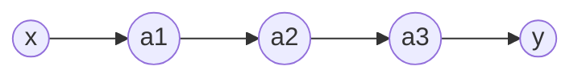
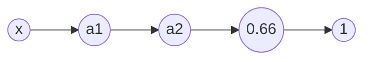
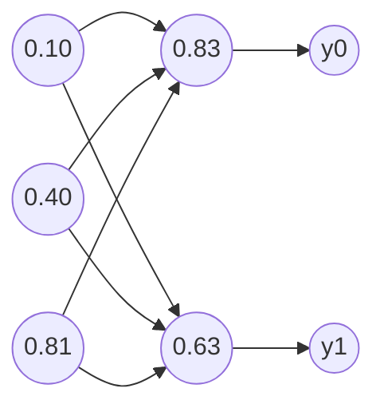

Simple one-line network:

==Cost function==: $C_0(...)=(a^{(L)}-y)^2$ where $y$ is the desired output.

$$
(0.66-1.00)^2
$$
==Last layer's activation==:
$$
z^{(L)}=w^{(L)}a^{(L-1)}+b^{(L)}
$$
$$
a^{(L)}=\sigma (z^{(L)})
$$
==Chain rule== (sensitivity of the cost function to the weight of the last layer):
$$
\frac{\partial C_0}{\partial w^{(L)}}=
\frac{\partial z^{(L)}}{\partial w^{(L)}}
\frac{\partial a^{(L)}}{\partial z^{(L)}}
\frac{\partial C_0}{\partial a^{(L)}}
$$
$$
\frac{\partial C_0}{\partial a^{(L)}}=2(a^{(L)}-y)
$$
$$
\frac{\partial a^{(L)}}{\partial z^{(L)}}=\sigma' (z^{(L)})
$$
$$
\frac{\partial z^{(L)}}{\partial w^{(L)}}=a^{(L-1)}
$$
Summarized:
$$
\frac{\partial C_0}{\partial w^{(L)}}=
a^{(L-1)}
\sigma' (z^{(L)})
2(a^{(L)}-y)
$$
The ==derivative of the full cost function== is equal to the average of all cost function calculated from all training examples:
$$
\frac{\partial C}{\partial w^{(L)}}=
\frac{1}{n}\sum_{k=0}^{n-1}\frac{\partial C_k}{\partial w^{(L)}}
$$
This gives us one component of the ==gradient vector==:
$$
\nabla C=
\begin{bmatrix}  
\frac{\partial C}{\partial w^{(1)}} \\  
\frac{\partial C}{\partial b^{(1)}} \\
... \\
\frac{\partial C}{\partial w^{(L)}} \\  
\frac{\partial C}{\partial b^{(L)}} \\
\end{bmatrix}
$$
The sensitivity of the cost function to the bias of the last layer or the activation of the layer before that can be calculated the same way:
$$
\frac{\partial C_0}{\partial b^{(L)}}=
\frac{\partial z^{(L)}}{\partial b^{(L)}}
\frac{\partial a^{(L)}}{\partial z^{(L)}}
\frac{\partial C_0}{\partial a^{(L)}}=
\sigma' (z^{(L)})
2(a^{(L)}-y)
$$
$$
\frac{\partial C_0}{\partial a^{(L-1)}}=
\frac{\partial z^{(L)}}{\partial a^{(L-1)}}
\frac{\partial a^{(L)}}{\partial z^{(L)}}
\frac{\partial C_0}{\partial a^{(L)}}=
w^{(L)}
\sigma' (z^{(L)})
2(a^{(L)}-y)
$$
We can iterate the same calculation backwards.

In case of multiple neurons in the layers:

$$
C_0=\sum_{j=0}^{n_L-1}(a_j^{(L)}-y_j)^2
$$
$$
z_j^{(L)}=
w_{j0}^{(L)}a_0^{(L-1)}+
w_{j1}^{(L)}a_1^{(L-1)}+
w_{j2}^{(L)}a_2^{(L-1)}+
b_j^{(L)}
$$
$$
a_j^{(L)}=\sigma (z_j^{(L)})
$$